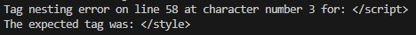
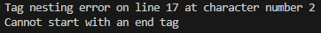
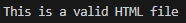

# html-validator
This was a university project where I had to make an HTML validator. I went above and beyond by making it validate any HTML other than the ones provided for the project.

## Example Output Messages:
### Tag Nesting Error

### End Tag Error

### Valid HTML

